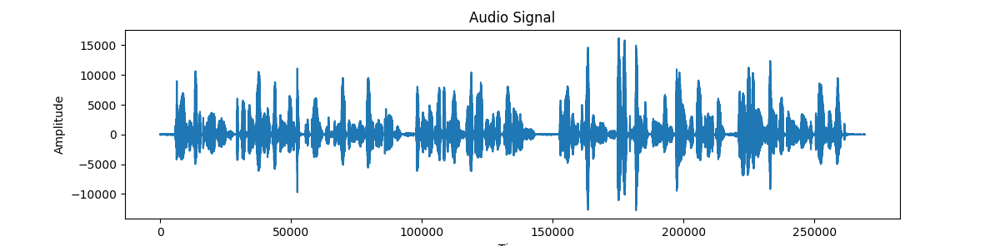

# Mel-Frequency-Cepstral-Coefficients-MFCC:

### Mel Frequency Cepstral Coefficients (MFCC) Using SciPy:
 
MFCC feature extraction is complicated to explain, but easy to implement with available libraries.

In this short quiz, you'll write a function that converts a .wav file to MFCC features. You'll need a way to extract the signal from the wave file and then a method
to convert the signal to MFCC. Here are the resources you need to write your function:

scipy.io.wavfile.read (to extract the signal)
python_speech_features.mfcc (to convert to MFCC)
When you succeed in returning the correct file, you will "see" the MFCC spectrum in the output similar to the following:

  

  

